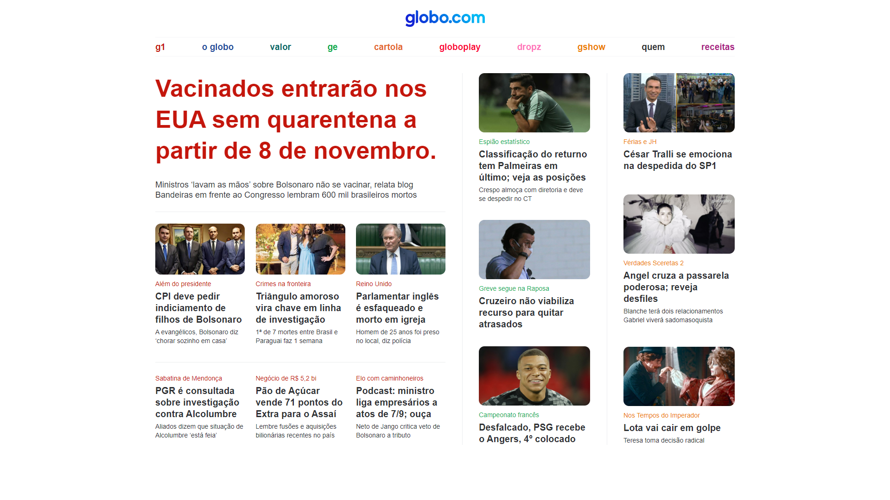

# Globo.com

Esse projeto tem uma interface fixa e foi inspirado no site [Globo.com](https://www.globo.com/).

---

## Confira:

<p align="start">
  
</p>

* Você pode acessar essa aplicação nesse link:
[https://nicoladla.github.io/Globo.com-Clone/](https://nicoladla.github.io/Globo.com-Clone/)

---

## Informações técnicas

Essa aplicação foi desenvolvida utilizando as tecnologias: 
* HTML
* CSS

### Como iniciar o projeto na minha máquina?

* O primeiro passo é você fazer o download do projeto para sua máquina ou então clonar esse repositório através do seu terminal:

```
git clone https://github.com/Nicoladla/Globo.com-Clone.git
```

* Após isso, você pode entrar na pasta do projeto e abrir o arquivo ``index.html`` no seu navegador.
